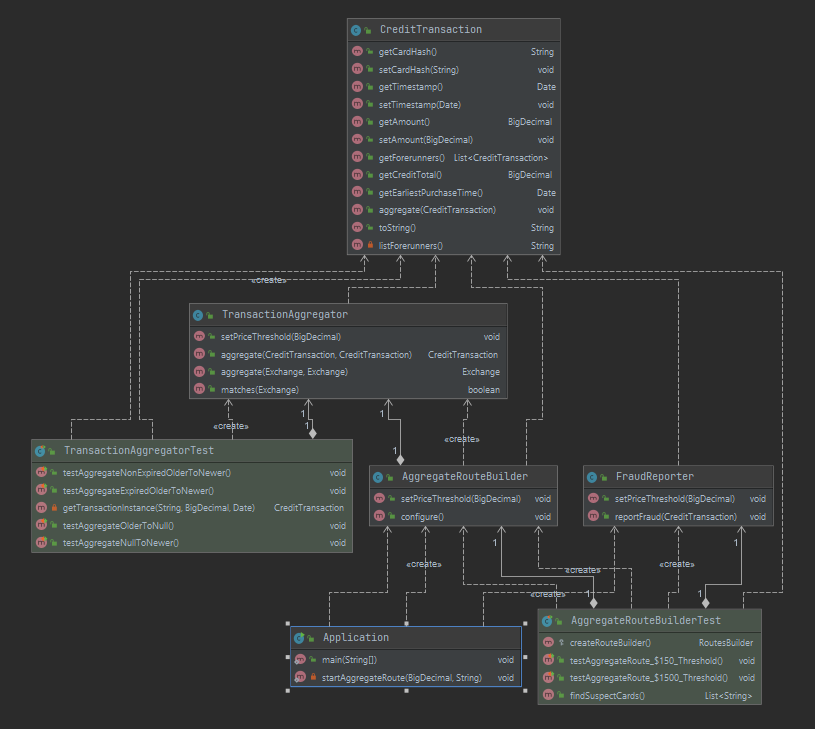

# Fraud Detector

## Overview
This is a Java 8 standalone application accepting a stream of credit card transactions in a CSV file. The solution correlates and aggregates transaction from the credit card number and reports any card spending more than a specific threshold during a 24 hour sliding window as candidate fraud. The application is modularly designed as Mode-View-Controller. The processed file is moved to a `.camel` subdirectory as a sign of completion.

## Component View
- Multitiered design (Apache Camel route object as the controller, backed by an Aggregator object as a service layer, and a data tier consisting of a card transaction entity that is serialised using Bindy CSV  library. Suspect credit cards are reported through warning statements to the application log (stdout).

## Main Technology Choices
- Built as a standalone application for the sake of simplicity.
- Apache Camel was used as a suitable implementation of the Aggregator integration pattern.
- Gradle was used to manage dependencies and generate the uber JAR.
- Junit was used to create Unit/Integration tests.

## UML Class Diagram


## Synopsis
To build (package) the uber JAR
```bash
$ ./gradlew clean build
```
To run the application
```bash
$ java -jar build/libs/fraud-detector-1.0.0.jar 150.00 transactions.csv
2021-03-29T14:31:35 WARN  c.walid.detector.view.FraudReporter - Card 86e7b63091a64b24b4fe8ecd3f77e43b exceeded the $150.00 threshold by $20.00 across 3 transaction(s) between Sat Mar 27 03:15:54 AEDT 2021 and Sat Mar 27 20:45:54 AED
T 2021
2021-03-29T14:31:35 WARN  c.walid.detector.view.FraudReporter - Card d5914a725e3548618634495eff9064f2 exceeded the $150.00 threshold by $40.00 across 2 transaction(s) between Sat Mar 27 20:09:12 AEDT 2021 and Sun Mar 28 06:39:12 AED
T 2021
2021-03-29T14:31:35 WARN  c.walid.detector.view.FraudReporter - Card d7ec1f1b48794338bc08ed4fc4e0472d exceeded the $150.00 threshold by $1850.00 across 1 transaction(s) between Sun Mar 28 06:39:12 AEDT 2021 and Sun Mar 28 06:39:12 A
EDT 2021
$
```
To find the processed file (Camel moved to `.camel/` after processing completes)
```bash
$ ls .camel
transactions.csv
```